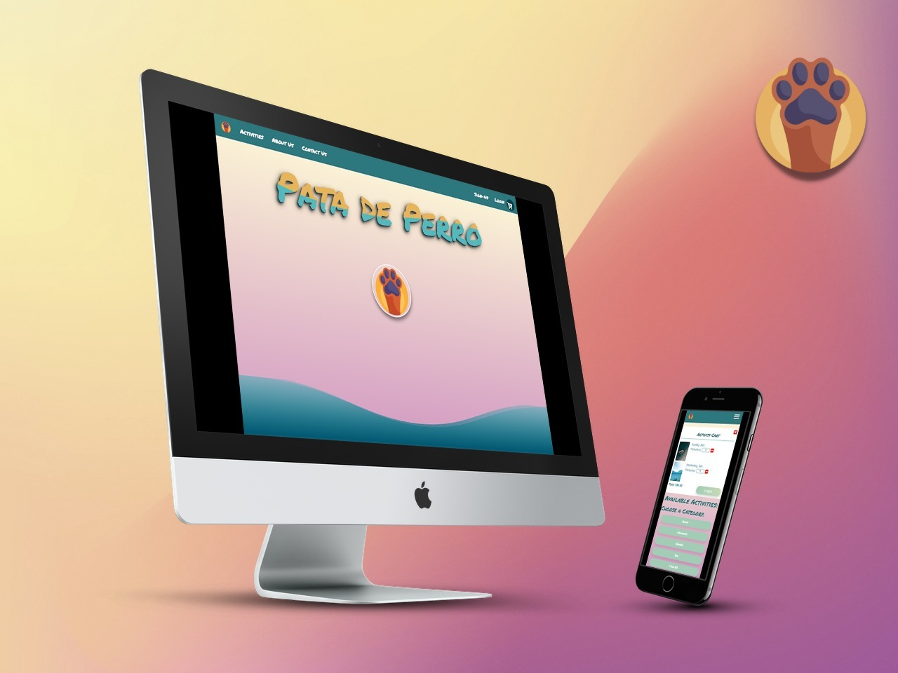
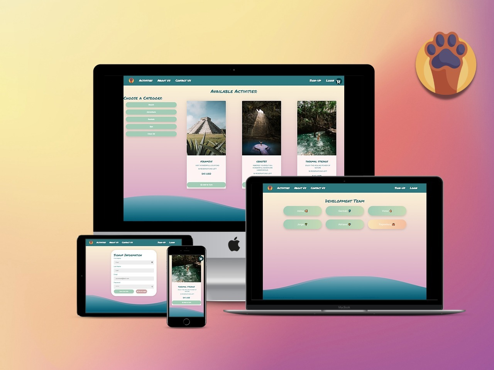

 [](https://opensource.org/licenses/MIT)


# Pata de Perro  </img>

  *"Enjoy your vacation activities by booking on-line with *__Pata de Perro__*. We offer a wide variety of services."*
  
  >** *__Disclaimer__*: although the app has payment functionality, please do not make payments since we do not provide the services shown in the app **

  *__Pata de perro__* is a Mexican expression that refers to people who have a strong desire to travel, to leave a place, or just to be out in the street.

  ## Description
  
  __AS__ a tourist, the user wants to look for a wide variety of summer activities where they:<br>
  __CAN__ view, select, and book a variety of available tourist experiences,<br>
  __SO THAT__ they can make the most of their vacation time.
  
This application includes functionality described in the Features section below.


## Table of Contents
  - [Description](#description "Description")
  - [Features](#features "Features")
  - [Technologies](#technologies "Technologies")
  - [Installation](#installation "Installation")
  - [Tests](#tests "Tests")
  - [Mockup Images](#mockup-images "Mockup")
  - [Contributors](#contributors-to-this-project "Contributors")
  - [Questions](#questions "Questions")
  - [Links to the App](#links-to-the-app "Links to App") 


____________________

  ## Features

  Current features include:

  - Navigator
    - Home, where the paw will take the user to About Us
    - Login for users to enter the page or  Signup if visiting for the first time
    - Activities display for the user to pick and book
    - Cart for the user to see the cost of their selected activies before proceeding to pay
    - Profile for the user to update their information (future feature)
    - Logout to leave the session


  - Home or landing page: on-click of the paw, the user is taken to the `About Us` page
  
  - When the user clicks on Activities, images with descriptions appear for the user to pick, but they must log in to purchase 

  - Login/Signup -> existing users can:
      - view the `Order History`
      - update their profile information (future feature)
      - pick, book and pay
      - access the full functionality of the website  

  - Cart: when the user picks an activity to book, they can see their selected items in the cart

  __Future features__ may include:
  1. Ability for the user to update their profile info and password
  2. Booking availability with dates and times
  3. Filter by location
  4. Admin site to update activities and categories
  5. Streaming videos of activities

_______

 ## Technologies
  
  | Back-end | Front-end |
  | -------- | --------- |
  | MERN | CSS |
  | GraphQL | Styled-components |
  | JWT | Font awesome |
  | Stripe |  |
  | | |

   
> We also included the service workers and the manifest.   

_______

  ### Installation

  You can install this application by running it on the command line


```
npm install
npm run seed
npm run develop
```
_____

  ## Tests

  We included some reducers testing on functionality for this project.

  ```
  cd client
  npm run test

  ```

____

  ## Mockup images

  Functionality is shown below:   
  
  
  

  ## Animation
  1. The first animation depicts an existing user logging into the website, navigating through the `Activities` section, selecting an activity and proceeding to checkout in the `Cart` and submitting payment. Then being redirected back to the page and looking at their `Order History`.   

  

  2. The second animation depicts the user browsing to the `About Us` section in the navbar, where when redirected, the user can click on the developers buttons, which will open in a different browser page (depicted on the fourth animation). The user then navigates to the `Contact Us` page, sending a message. Also, browsing to `User Profile` where in __future__ __features__ the user will be able to update their information and password.

 

  3. Third animation: shows the new user functionality to sign up by creating their account. New users will then have the same access capability as the one depicted in the second animation.

   

  4. The fourth animation depicts the user browsing through the `About Us` development team, being able to click on each developer to be redirected to the their respective GitHub Repositories.
  Also, it shows the app manifest and service workers. The user can select activities that will save in their carts while they are off-line, and those will be available and visible when they go on-line.


_____

  ## Contributors to this project

  | Contributors | GitHub Repo |
  | ------------ | :-----------: |
  | Adina Henderson| [🐠<](https://github.com/adina-hc "Adina's GitHub Repo") |
  | Adriano Armendaris|[🏄](https://github.com/AdrianoArmen "Adriano's GitHub Repo") |
  | German Ramirez|[🐬](https://github.com/izaack89 "German's GitHub Repo") |
  | Jorge Soto|[🌴](https://github.com/jorgeatcabo "Jorge's GitHub Repo") |
  | Victor Vallejo|[🐚](https://github.com/vicvallejo "Victor's GitHub Repo") |

___________

  ## Questions
  If you have any questions or would like to report any issues, please contact us at:
  
  [eMail address](adinahenderson.mail@gmail.com "email-to adinahenderson.mail@gmail.com")  
  
______________________

  ## Links to the App
     
  Repo:
  [🦀](https://github.com/adina-hc/pata-de-perro "Pata de Perro GitHub")

  App:
  [Deployed App](https://shrouded-bayou-22662.herokuapp.com/ "Pata de Perro Heroku")